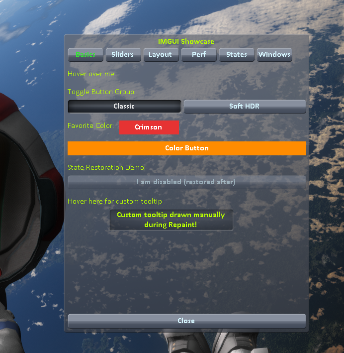
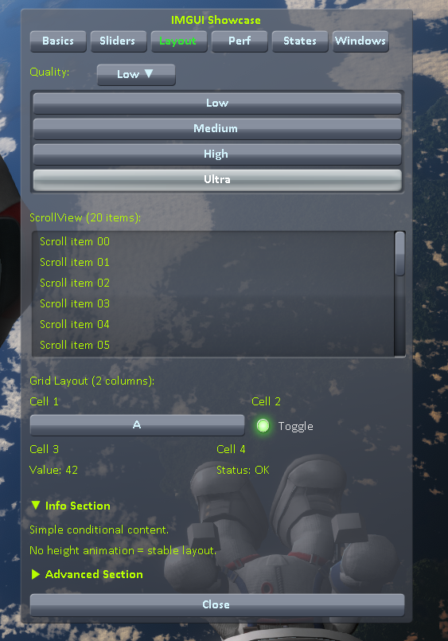
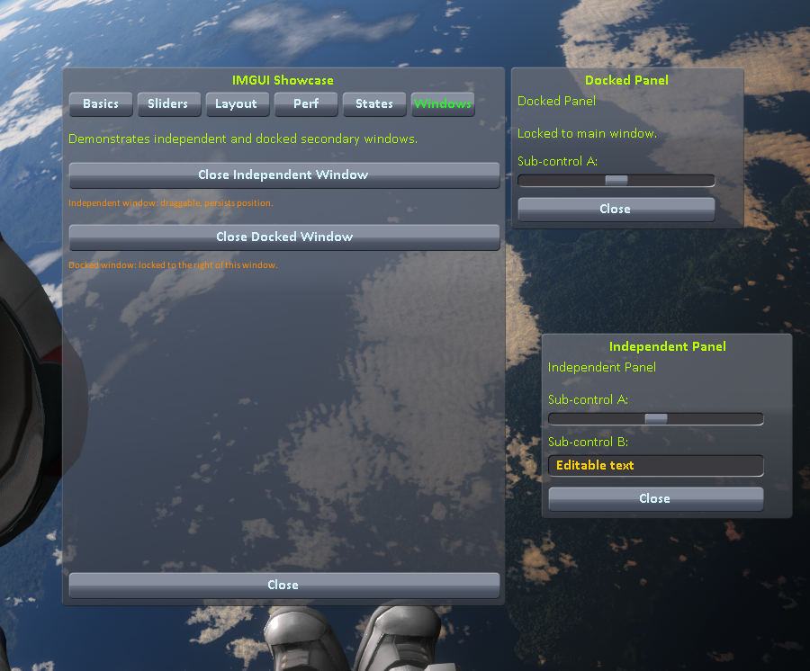
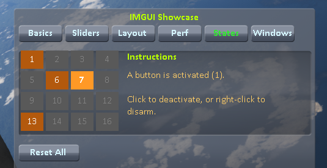

# IMGUI_Helper

This work-in-progress mod is meant to serve as a showcase/reference of IMGUI UI "features" and "capabilities" that I've figured out so far.  I am not an expert at IMGUI, or C#, or anything - but I often see people asking about how to do tooltips, dropdowns, tabs, etc, and this project can serve as a guide for a way to do those things.  If you see something in here that looks "bad" or could be improved(like if my pattern for capturing right-clicks isn't right, or repaint/layout guards are a problem, etc), please file an issue report and let me know - the hope is that this project can expand and improve over time and serve as a working example for building UI's in IMGUI for KSP mods to answer those questions like "How do I make a tooltip?".

## Screenshots

